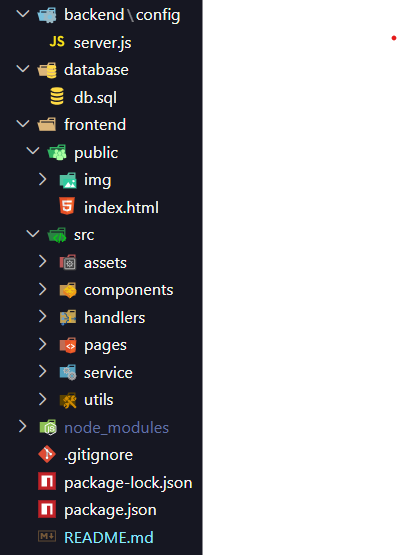

# 💈 BarberApp

O **BarberApp** é um sistema web desenvolvido para barbearias, oferecendo uma solução completa de **agendamento online, gestão de clientes, controle financeiro e administração de serviços**.  
Ele possui área exclusiva para **barbeiros** (administração) e uma interface simples para **clientes** realizarem seus agendamentos.

---

## 🚀 Funcionalidades

- **Autenticação** para clientes e administradores  
- **Agendamento online** de horários  
- **Controle de clientes** (cadastro, edição e consulta)  
- **Gestão de serviços** (cortes, barba, combos, etc.)  
- **Controle financeiro** com registro de despesas  
- **Dashboard administrativo** com visão geral  
- **Planos mensais e assinatura de serviços**  
- Interface responsiva e moderna usando **TailwindCSS**

---

## 🛠️ Tecnologias Utilizadas

- **HTML5**  
- **CSS3** (TailwindCSS + Font Awesome)  
- **JavaScript (ES Modules)**  
- **Google Fonts (Inter)**  

---

## 📂 Estrutura do Projeto



---

## ▶️ Como Executar o Projeto

1. Clone este repositório:

   ```bash
   git clone https://github.com/diogene01/BarberApp.git

2. Abra o arquivo index.html diretamente no navegador.

⚠️ O projeto não requer servidor backend neste momento (100% frontend).

---

## 📌 Melhorias Futuras

- Integração com banco de dados (MySQL ou Firebase)
- API REST para agendamentos em tempo real
- Notificações por e-mail ou WhatsApp para clientes
- Área administrativa com relatórios avançados